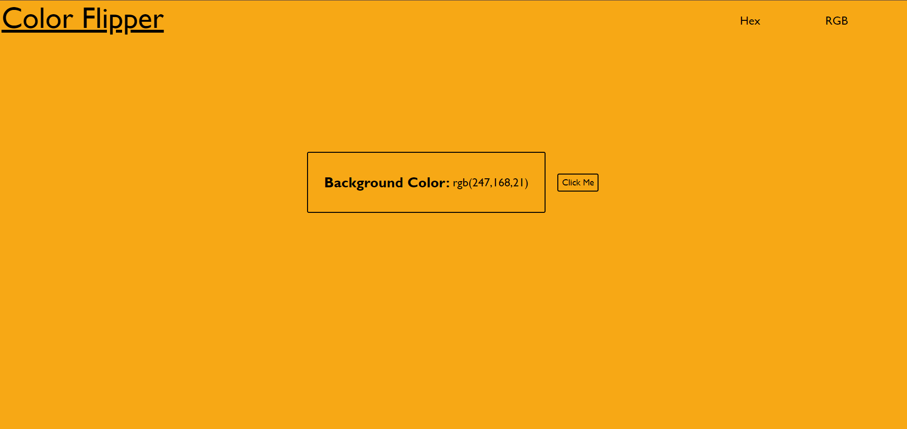

# Color-Flipper

A Color Flipper is a simple project that changes the background color of a webpage randomly each time a button is clicked, utilizing hex, RGB, or a combination of both color formats.

## Features
* ### Hex Color Flipper:
Changes webpage background to random hex color on button click.

* ### RGB Color Flipper:
Alters webpage background to random RGB color on button click.

* ### Random Color Flipper:
Modifies webpage background to random color on button click.

